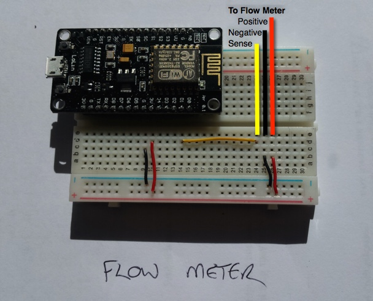
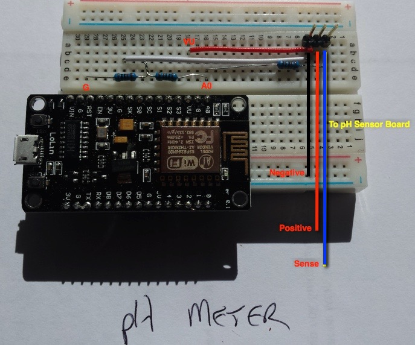

This folder contains details of the hardware we used

The Flow meter is a simple hall effect sensor with 3 connections

+V  
-V  
Sense

You can usually run these from 3.3V

The pH meter recommended needs 5V to operate.  Using the NodeMCU board recommended allows you to provide power from the VU pin on the board which provides 5V from the USB connection. Note that not all NodeMCU boards have this available.

The resistor divider network is to step down the 5V coming back from the board to 3.3V. Each resistor is 1K (3.3V is 2/3 of 5V, conveniently!)

