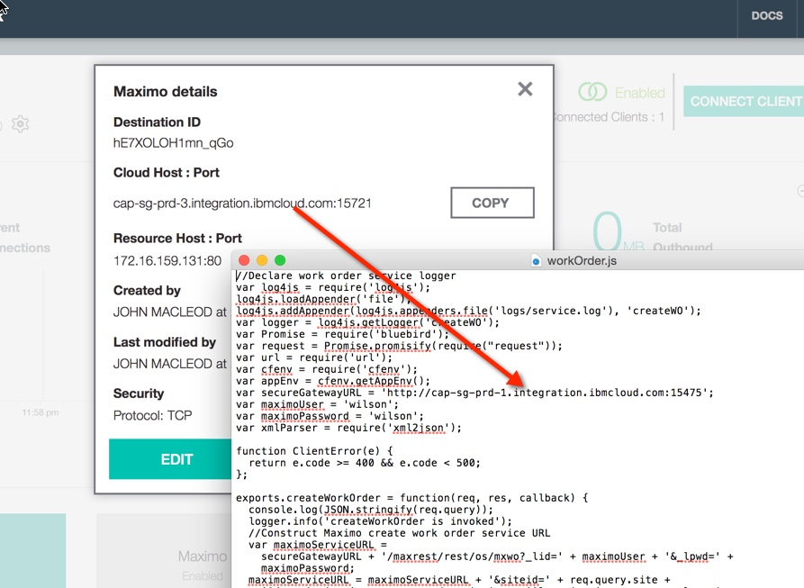
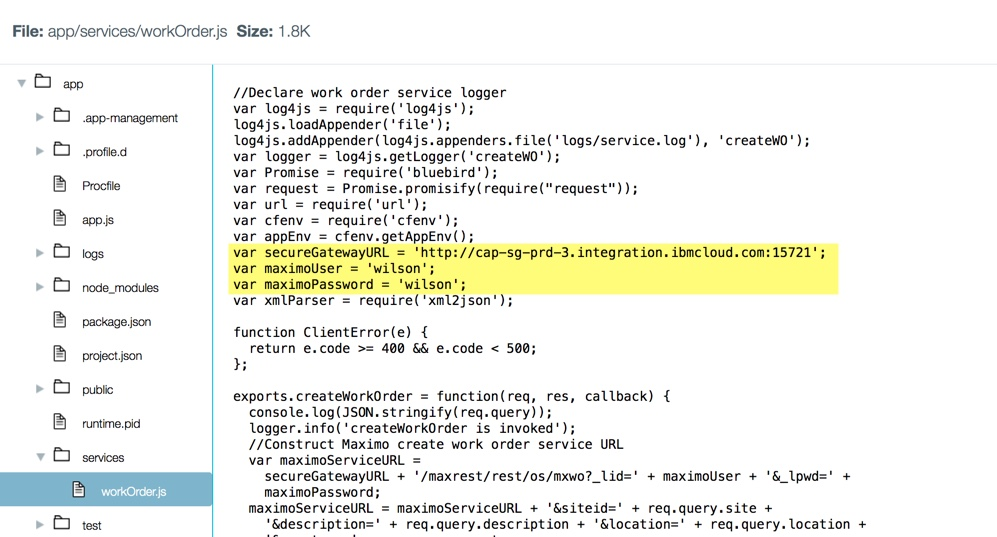

There are 3 significant components to this project

1) The sketches that are loaded onto the ESP8266 boards
2) The Node-Red flows that provide the dashboard and raise the maximo work orders
3) The maximo installation & helper app

The Maximo installation is norally run on a laptop connected via a secure gateway from BlueMix.  A small helper app is also installed on BlueMix to simplify the creation of the Maximo work order and hide the username & passwords used.

Follow the normal procedure to create a secure gateway connection from bluemix to the laptop.  This setup will provide you with a URL which is later used to configure the Maximo helper app installed on Bluemix.

The file to update is 

The variables you may need to update (secure gateway URL, username, password) are highlighted.
